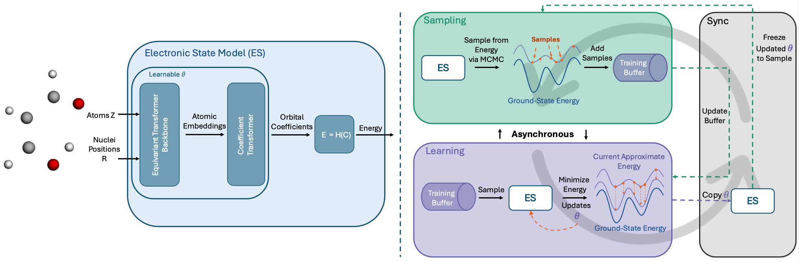

# Self-Refining Training for Amortized Density Functional Theory

<p align="center">
  <a href="https://arxiv.org/abs/2506.01225">
    
  </a>
</p>

We introduce an efficient method that simultaneously trains a deep-learning model to predict the DFT outputs and samples molecular conformations that are used as training data for the model. We derive our method as a minimization of the variational upper bound on the KL-divergence measuring the discrepancy between the generated samples and the target Boltzmann distribution defined by the ground state energy. To demonstrate the utility of the proposed scheme, we perform an empirical study comparing it with the models trained on the pre-collected datasets. Finally, we provide an asynchronous implementation of the proposed algorithm, enabling simultaneous sampling and training.

<p align="center">
  
</p>

## Setup
Define the environment variables in `.env.example` file and rename to `.env`

## Install
```
"${SHELL}" <(curl -L micro.mamba.pm/install.sh)
micromamba create --file environment.yaml
```

## Train
```
python src/train.py experiment=train/srt/ethanol-100
```

## Evaluation
```
python src/eval.py experiment=eval/srt/ethanol-100

```

## Citation

<div align="left">

If you find this code useful in your research, please cite the following paper (expand for bibtex):

<details>
<summary>
M.Hassan, C.Gabellini, H. Helal, D. Beaini, K. Neklyudov. Self-Refining Training for Amortized Density Functional Theory, 2025.
</summary>


```bibtex
@misc{hassan2025selfrefining,
      title={Self-Refining Training for Amortized Density Functional Theory}, 
      author={Majdi Hassan and Cristian Gabellini and Hatem Helal and Dominique Beaini and Kirill Neklyudov},
      year={2025},
      eprint={2506.01225},
      archivePrefix={arXiv},
      primaryClass={cs.LG},
      url={https://arxiv.org/abs/2506.01225}, 
}
```
</details>

## Contribute

We welcome issues and pull requests (especially bug fixes) and contributions. We will try our best to improve readability and answer questions!

## Licences

This repo is licensed under the [MIT License](https://opensource.org/license/mit/).